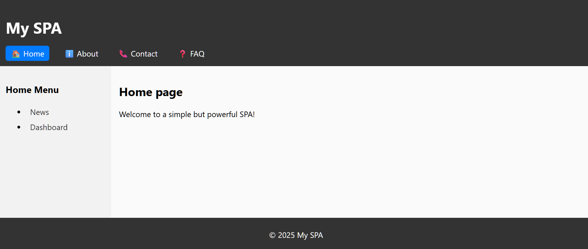

<h1 align="center">🧩 Simple-SPA-Example</h1>

A simple, lightweight, and reliable Single Page Application (SPA) boilerplate designed to work flawlessly on GitHub Pages. This project demonstrates how to build a modern SPA without complex frameworks, using only vanilla JavaScript, HTML, and CSS. It's a great starting point for personal websites, project documentation, or any other static site that needs dynamic page loading.

  <!-- GitHub badges -->
  
  
  

## 🚀 Live Demo

> **Try it instantly:**  
> https://israice.github.io/Simple-SPA-Example/
 

## Features

*   **No build tools required:** Works out of the box, just edit the files and push to GitHub.
*   **Simple hash-based routing:** Uses the URL hash (`#`) to navigate between pages without full page reloads.
*   **Dynamic page loading:** Page content is loaded asynchronously from the `FRONTEND` directory.
*   **Template support:** Reusable templates for `header`, `footer`, and a dynamic `sidebar`.
*   **Nested navigation:** The sidebar dynamically updates to show child pages based on the selected top-level topic.
*   **Smooth page transitions:** Uses CSS animations for fade-in/fade-out effects between page loads.
*   **Caching:** Caches loaded pages and templates in memory to reduce redundant network requests.

## How it works

The project follows a simple and intuitive structure:

*   `run.py`: FastAPI server that serves the frontend.
*   `FRONTEND/`: All frontend files in a single directory:
    *   `index.html`: The entry point with containers for header, sidebar, content, and footer.
    *   `app.js`: Core JavaScript logic — routing, page loading, templates, sidebar navigation.
    *   `style.css`: Stylesheet with smooth transition animations.
    *   `*.html`: Page content files (`home.html`, `about.html`, etc.) and reusable templates (`header.html`, `footer.html`). The sidebar is generated dynamically by `app.js`.

## Getting Started

1.  **Clone or fork this repository.**
2.  **Push it to your own GitHub repository.**
3.  **Enable GitHub Pages:**
    *   Go to your repository's **Settings**.
    *   Navigate to the **Pages** section.
    *   Select the `main` (or `master`) branch as the source and click **Save**.
4.  **That's it!** Your SPA will be live at the URL provided by GitHub.

## Dev Roadmap
- [ ] v.0.0.2 create in sidebar toggle as toggled menu
- [x] v.0.0.1 SPA all basics created

### Github Update
git add .
git commit -m "v.0.0.1 SPA all basics created"
git push

